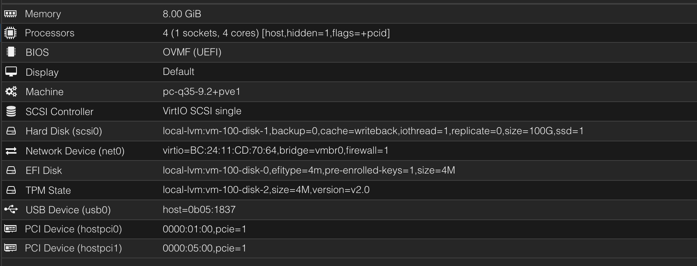

# GPU Passthrough

Tested on ASUS ROG GL502VS with a Intel i7-6700HQ & 1070. Not sure if all steps are needed but it works in this state. 

Place all files in their locations, except `grub` just set the commandline to match.

```bash
update-initramfs -u -k all
update-grub
reboot
```


Set VM hardware like so


Cores/Memory/Boot disk size can be adjusted. 
hostpci1 is a passed through NVMe drive. Can be skipped if not doing this. 


If display isn't set to default the GPU doesn't work. (code 43)


edit `/etc/systemd/logind.conf` 

```ini
HandleLidSwitch=ignore
HandleLidSwitchExternalPower=ignore
HandleLidSwitchDocked=ignore
```

`systemctl restart systemd-logind.service`